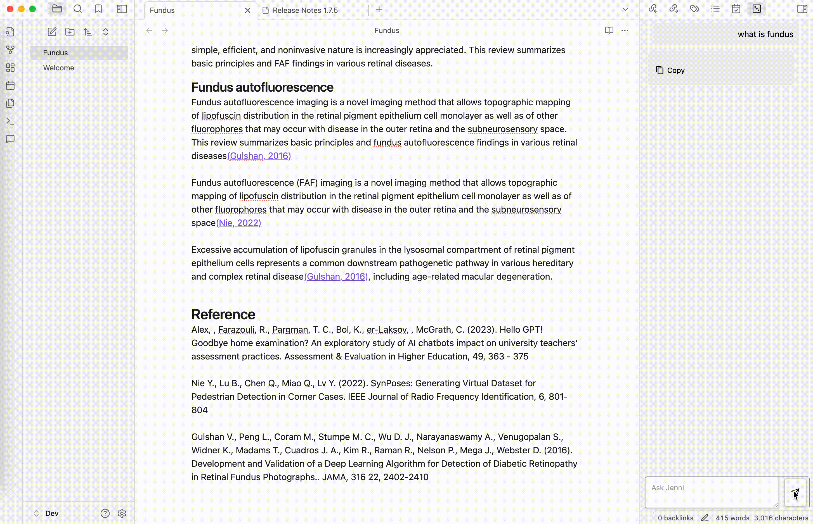
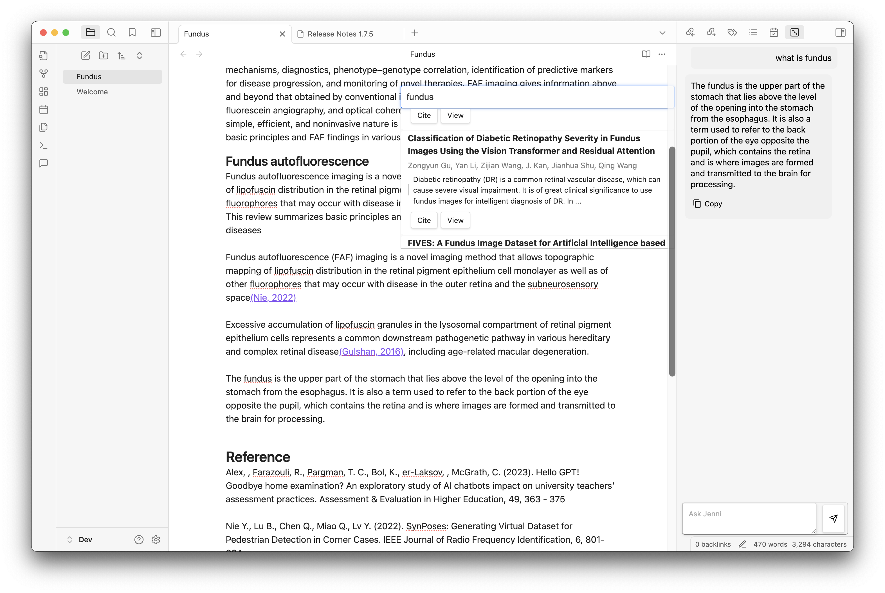

# Obsidian Plugin for Research & Writing Enhancement

This powerful Obsidian plugin is designed to streamline your research and writing workflow with features that improve citation management and writing assistance. With a user-friendly interface, it combines academic reference management with AI-driven support.

---

## Key Features

### 1. **Quick Citation Search & Insertion**
Easily search for academic articles and add them to your document with a simple keyboard shortcut. The plugin automatically formats in-text citations and generates references in APA style.



### 2. **ChatGPT-Powered Writing Assistant (Jenni)**
Interact with Jenni, an AI-powered writing assistant that helps you improve your content and productivity. Powered by ChatGPT, Jenni offers writing suggestions, answers queries, and assists with research.



---

## Why Use This Plugin?

- **Efficiency**: Quickly search and insert citations, saving you time on manual formatting.
- **Accuracy**: Automated generation of APA-style citations ensures consistency and correctness.
- **AI Support**: ChatGPT-powered Jenni provides writing assistance and interactive support.
- **Free to Use**: Fully available at no cost.

---

## Installation

1. Download and install the plugin in Obsidian.
2. Configure your OpenAI key in the setting tab.
3. Start adding references and interacting with Jenni for a smoother writing experience.

---

## Get Started

Start enhancing your research and writing today with the Obsidian plugin! Feel free to explore its features and experience how it can simplify your academic work.

---

## API Usage

This plugin utilizes the Semantic Scholar API for citation searches. The API endpoint used is:

```javascript
const url = "https://api.semanticscholar.org/graph/v1/paper/search";
```
Additionally, the plugin submits queries to ChatGPT to provide writing assistance through the AI-powered assistant, Jenni.

